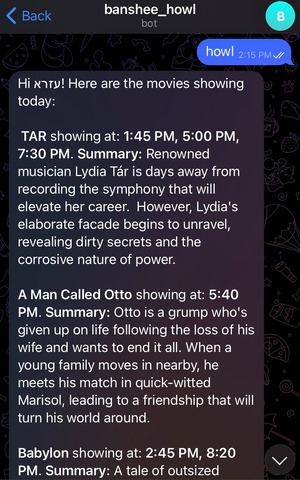

 

  <h3 align="center">BANSHEE</h3>

## Table of Contents

* [About](#about)
  * [Built With](#built-with)
* [Getting Started](#getting-started)
* [Contact](#contact)

## About

Scraping the 'now playing' section of my local movie theatre's website. It doesn't contain any rating information or a detailed summary, so I use Puppeteer to grab the 'now playing' film titles and show times, and then grab further information for each film from TMDB API, e.g. cast and summary. Currently this is run twice a day via a Cron setting in the `scheduled-jobs.yml` workflow file.

This data is then stored in a MongoDB Atlas collection, and exposed via a Netlify Function. The Netlify Function is tested using Postman.

Finally, a Telegram bot (banshee_howl_bot) makes a call to the Netlify Function to get and display the data whenever a user sends `howl` to the bot.

### Built With/Uses:

* Puppeteer
* MongoDB
* GitHub Actions
* Postman
* Telegraf

## Getting Started

To get a local copy up and running follow these steps:

1. clone the repo (you will need a `.env` file with your own MongoDB secrets)
2. run `npm install`
3. run `npm run scrape` to scrape the movie data and save it to a `data.json`
4. run `npm run test` to test that `data.json` has the expected keys and that the values are of the expected types
5. run `npm run seed` to clean and reseed the db with the latest films

## TO DO

- [x] Build scraper
- [x] Use TMDB API instead of scraping TMDB
- [x] Setup GitHub Workflow
- [x] Create Netlify Function
- [x] Add Postman tests (may remove these in the future)
- [x] Create Telegram Bot with Netlify Function
- [ ] Clean up code

## Contact

Ezra Mizrahi - ezra.mizrahi@hey.com